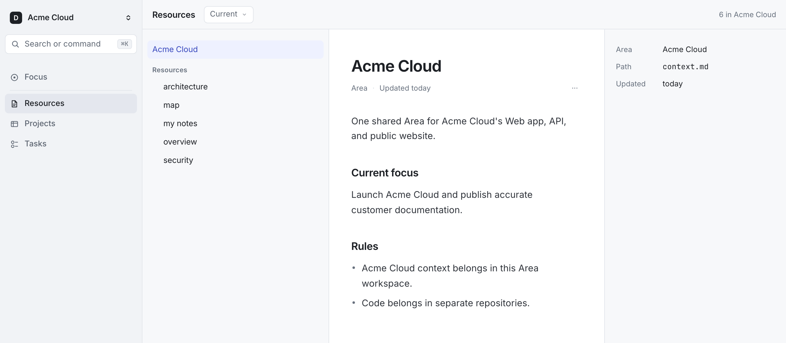
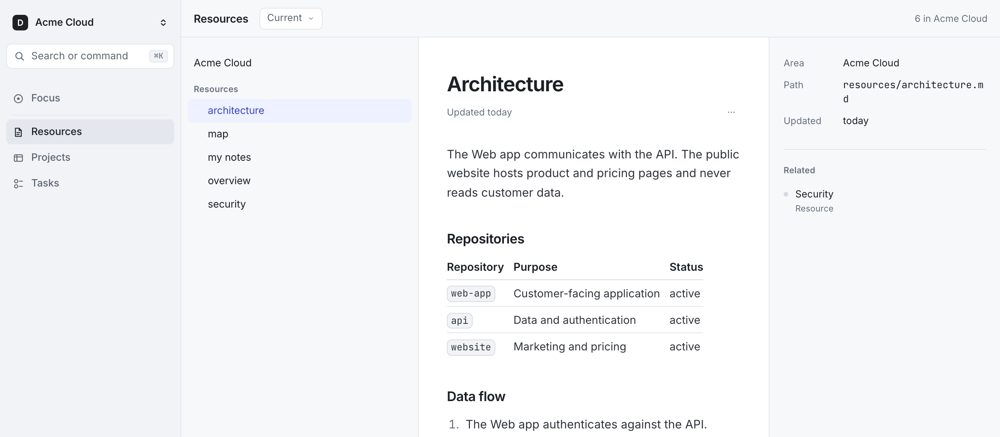
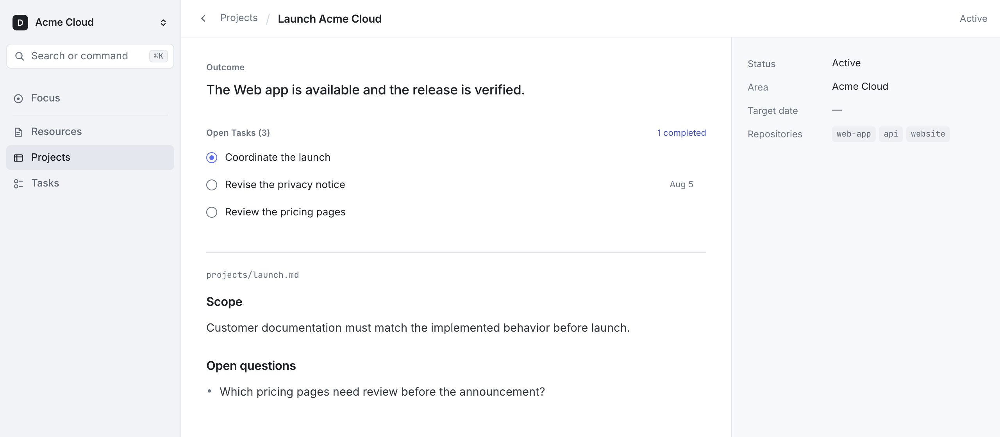
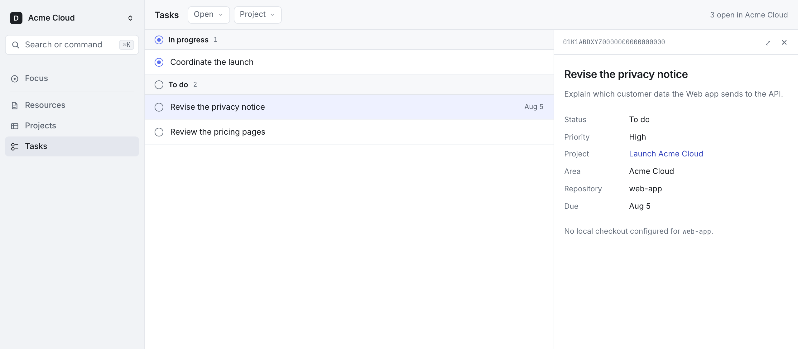

# Dokito

[](https://github.com/sgasser/dokito/releases/latest)
[](LICENSE)


**Dokito keeps knowledge, projects, and tasks in local Markdown files, for you
and your agents.**

Every durable responsibility gets an **Area**: a folder of Markdown files
holding its context, projects, resources, and tasks. One per product, per
client, or for a standing scope such as Personal — and everything that belongs
to it lives there, the marketing and the support notes next to the code.

Agent memory usually lives inside one code repository and stops at its edge. An
Area sits outside them: it can connect zero, one, or many Repositories, every
checkout resolves back to it, and it also holds the work that has no repository
at all. An agent reads the short Area overview first and opens a Project,
Resource, or Task only when the work calls for it.



There is no database and no hosted backend. Plain Markdown is the format, so
any editor opens it, Git versions it, a pull request reviews it, and nothing is
locked away the day you stop using Dokito. This is
[file over app](https://stephango.com/file-over-app): apps are ephemeral, your
files are not.

## What lives in an Area

- **Context** explains what the Area is and what matters now.
- **Projects** define outcomes with a beginning and an end.
- **Resources** preserve notes, decisions, research, and reference material.
- **Tasks** track the concrete work that moves an Area or Project forward.

The terminology is inspired by the
[PARA method](https://fortelabs.com/blog/para/).

## Install

### Install the CLI

macOS and Linux, signed and notarized on macOS:

```bash
curl -fsSL https://github.com/sgasser/dokito/releases/latest/download/install-dokito.sh | sh
```

The installer selects the correct download, verifies its SHA-256 checksum, and
installs `dokito` in `$HOME/.local/bin`. Add that directory to your shell's
`PATH`, then verify the install:

```bash
export PATH="$HOME/.local/bin:$PATH"
dokito --version
```

### Install the agent skill

The skill is how agents create and maintain Areas, and how you set up your
first one. With Node.js available, install it with
[`skills`](https://skills.sh), Vercel's open agent skills CLI, which detects
supported agents such as Codex and Claude Code:

```bash
npx skills add sgasser/dokito --skill dokito --global
```

The GitHub release also includes `dokito-skill.tar.gz` for manual installation.
Start a new agent session after installing the skill.

## Create an Area

With the skill installed, start with a normal request:

> Create a Dokito Area called Northwind in `~/Work/northwind`.

For software work, run the agent inside a checkout and ask it to connect that
Repository to the Area as well. From then on the checkout finds its own Area,
without a single Dokito file inside it:

```console
$ cd ~/Work/web-app
$ dokito context
Area: acme-cloud  /Users/example/Work/acme-cloud-area
Repository: web-app
Projects: 1  /Users/example/Work/acme-cloud-area/projects
Resources: 2  /Users/example/Work/acme-cloud-area/resources
Tasks: 1  /Users/example/Work/acme-cloud-area/tasks

# Acme Cloud

Launch the Web app and the API together. Docs must ship with them.
```

That is what your agent starts from. The skill creates, registers, and
validates the Area. To read it yourself, open the Web view:

```bash
dokito web start
```

The managed background process survives closed terminals and agent sessions.
Inspect or stop it with `dokito web status` and `dokito web stop`. Use
`dokito web` when you deliberately want the server in the foreground.

## Plain files on disk

Every Project, Resource, and Task is one Markdown file with a short YAML
header:

```text
acme-cloud-area/
├── dokito.yaml     # Area id and name, plus any connected Repositories
├── context.md      # what this Area is and what matters now
├── projects/
│   └── launch.md
├── resources/
│   ├── architecture.md
│   └── positioning.md
└── tasks/
    └── 01K1ABCXYZ0000000000000000-draft-the-launch-post.md
```

The architecture notes and the launch post sit in the same Area, because both
belong to the same product.

```markdown
---
status: in_progress
project: launch
priority: normal
---

# Draft the launch post

The current outline buries the pricing change in the last section.
```

The ULID prefix is the Task's identity; the rest of the filename is yours to
rename. Project and Task frontmatter is strict — unknown fields and invalid
values fail `dokito validate` — so an agent cannot quietly invent a shape of
its own. Resources stay free-form Markdown.

Documents link to each other by filename: `[[architecture]]` reaches
`resources/architecture.md` from anywhere in the Area. No link carries a path
from your machine, which is what lets you hand the directory to someone who
keeps it elsewhere.

Read them in any editor, grep them, review them in a pull request. These files
are the state. For manual setup and every supported file shape, see the
[specification](docs/SPEC.md).

## Many Areas, one overview

Areas stay separate. A product, a client, and your own affairs each carry their
own Context, and nothing from one bleeds into another. The CLI reads across all
of them, from any directory:

```console
$ dokito areas
Registered Areas: 3
- acme-cloud: Acme Cloud  /Users/example/Work/acme-cloud-area  (3 Repositories)
- northwind: Northwind  /Users/example/Work/northwind  (0 Repositories)
- personal: Personal  /Users/example/Work/personal  (0 Repositories)
Config: /Users/example/.config/dokito/config.yaml

$ dokito projects
Projects: 2 across 3 Areas
- [active] acme-cloud/launch: Launch Acme Cloud  repositories web-app, api
- [active] northwind/onboarding: Onboard Northwind
```

`dokito tasks` does the same for Tasks, and `dokito resolve <name>` says where
a name lives, listing every Area that holds it and every match inside them. The
Web view switches between Areas. However many Areas you keep, the overview
stays one command away — and an agent gets the same view from any directory on
the machine.

## Browse your work

### Resources

Keep notes, decisions, research, architecture, customer knowledge, and other
reference material.



### Projects

See each outcome together with its open work and connected Repositories.



### Tasks

Track concrete work by status, priority, due date, Project, or Repository.



## Work with people and agents

People edit Area files in any editor. The
[bundled skill](skills/dokito/SKILL.md) lets agents find the right Area and
write validated changes back. It also moves a selected Task to `in_progress`
when work starts and to `done` once the work and its checks succeed. The Web
view always reflects the current files.

Connecting a code Repository stores only its identity. Nothing is copied into
it, and Dokito resolves the same Area from any connected checkout. On macOS
with [Conductor](https://www.conductor.build/) installed, the Web view can also
start a Task there when a local checkout is available.

## Upgrading to 0.3

Links resolve by filename now, and two older forms stop resolving: a document's
heading, and a `../` path. An Area written before 0.3 keeps working, but those
links go quiet, so run `dokito validate` once — it names every link that no
longer resolves and, for a `../` path, the filename to write instead.

A Resource is also named by its file in the Web view, heading included, so an
H1 that says something the filename does not is reported rather than shown.

## Current limits

- Dokito is early-stage: commands and Markdown file formats may change between
  releases.
- Windows and package-manager installs are not supported yet.
- The Web view is read-only.
- Dokito does not import existing notes automatically.

## Data and privacy

Dokito stores Area files on your machine. It has no telemetry, cloud
service, or synchronization, and the Web view binds to `127.0.0.1`.

An Area stays local unless its files are published or shared. Content an agent
loads reaches that agent's model provider like any other prompt, so do not
expose material you would not send to that provider.

## Documentation and contributions

- [CLI reference](docs/CLI.md)
- [Specification](docs/SPEC.md)
- [Contributing](CONTRIBUTING.md)

Questions and bug reports belong in
[GitHub issues](https://github.com/sgasser/dokito/issues). Bug fixes and
documentation corrections are welcome; feature contributions are not accepted
for now.

## License

[Apache License 2.0](LICENSE)

The Web view embeds Inter and JetBrains Mono, both under the
[SIL Open Font License](https://openfontlicense.org/). Their license texts sit
next to the font files in `src/web/fonts/`.
