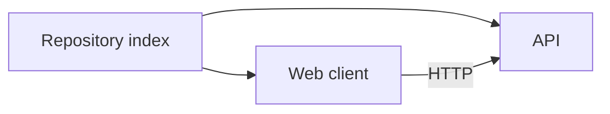

# Markdown torture

Inline `code`, **bold**, *italic*, ~~struck~~, a [link](https://example.invalid) and a footnote[^1].

## Table

| Repository | Owner | Status |
|---|---:|---|
| `web-app` | Platform | active |
| `api` | Team | paused |

## Nested list

- Top level with `inline-code` and more prose that should wrap normally
  - Nested item
    - Deeper still
- Second top level

1. Ordered
   1. Nested ordered
2. Back to top

Inline wiki inside code: `[[Security]]`

## Code block

```ts
const area = "product";
export { area };
```

## Diagram



## Link shapes

- [Umlaut](security.md)
- [Space](my notes.md)
- [Mail](mailto:hi@example.invalid)
- [Anchor](#table)
- [Script](javascript:alert(1))

## Definition-ish

Term
: not standard markdown

## Quote with code

> A quote containing `code` and **bold** text that runs long enough to wrap onto a second line naturally.

## Horizontal rule

---

## Image


## Task list

- [x] Done with `code`
- [ ] Open

[^1]: The footnote body.
